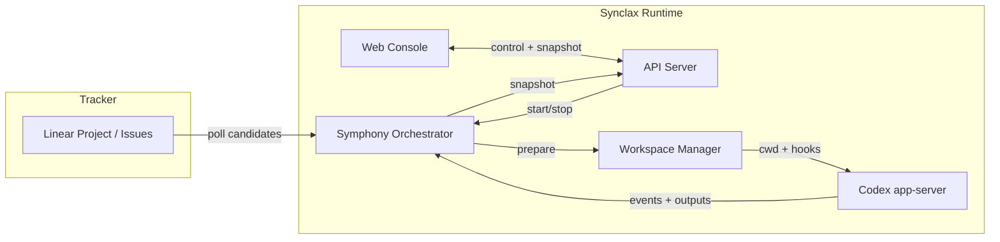
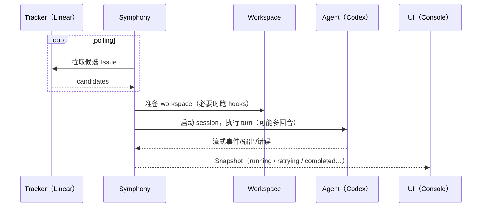

这一页不讲代码结构，只讲你作为使用者需要理解的“组成部分”和“数据怎么流动”。

<ImageZoom
  src="/images/workspace-grid.svg"
  alt="Synclax 组件与数据流概览"
  width={1200}
  height={640}
/>

## 1) 组件一览

- **Tracker（当前是 Linear）**：任务来源与状态机（Todo / In Progress / Done…）
- **Symphony（Orchestrator）**：控制循环与调度器（何时跑、并发、重试、卡死处理）
- **Workspace**：每个任务稳定的工作目录（含 hooks，方便“可重复执行”）
- **Agent Runtime（Codex app-server）**：真正执行工作的进程/会话
- **API Server**：对外提供“控制 + 状态投影”的统一入口（给 Web Console）
- **Web Console**：面向用户的操作与可视化（启动/停止、列表、阶段、重试、用量）

## 2) 高层数据流（从任务到 UI）

你可以把它简化为三件事：

1. **任务从 Tracker 来**
2. **Symphony 决定“现在跑谁”并驱动 Agent 在 workspace 里执行**
3. **UI 只看 Snapshot（系统的可解释投影）**

## 3) “一次执行”到底发生了什么（Attempt 生命周期）

## 4) 为什么“无需把 API URL 给用户”

对用户而言，API 不是产品界面；**Console 才是产品界面**。你只需要：

- Console 上能看懂状态（正在做什么/卡在哪里/是否重试）
- Console 上能控制生命周期（Start/Stop）

HTTP API 仍然存在（它是 Console 的后端契约），但它应该：

- 放在 Reference/Advanced（给需要集成的人）
- 不抢占用户学习路径的首页与 Quickstart
