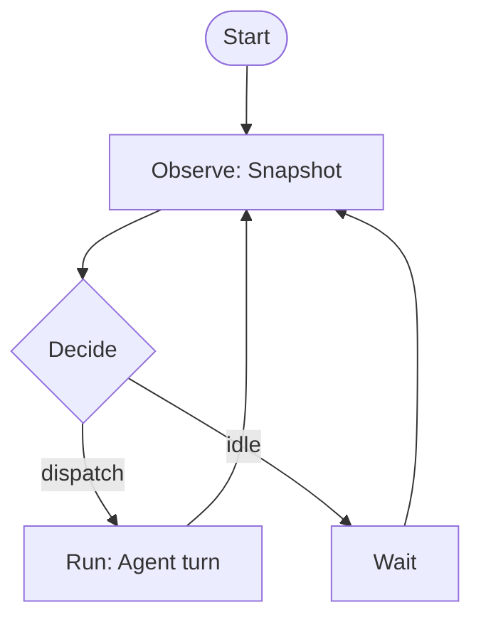
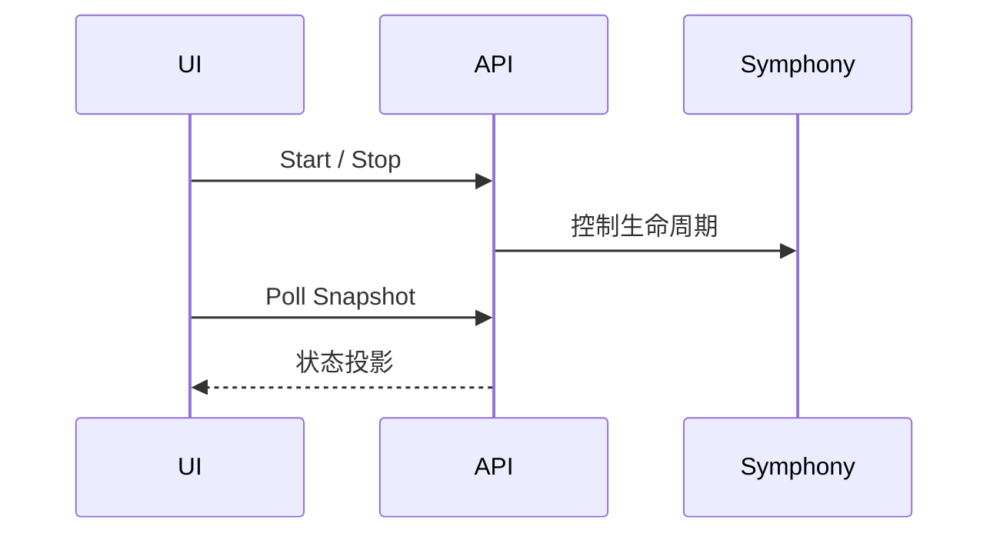

这一页的唯一目的，是给站点保留稳定的 Mermaid 渲染样例，方便回归验证。

<Callout type="info">
  Fumadocs 站点已通过 `remark-mermaid` 接入 Mermaid，本页可以在升级或改配置后快速确认渲染是否正常。
</Callout>

## Flowchart

```mermaid
flowchart TD
  Start([Start]) --> Observe[Observe: Snapshot]
  Observe --> Decide{Decide}
  Decide -->|dispatch| Run[Run: Agent turn]
  Decide -->|idle| Wait[Wait]
  Run --> Observe
  Wait --> Observe
```

## Sequence

```mermaid
sequenceDiagram
  participant UI
  participant API
  participant Symphony

  UI->>API: Start / Stop
  API->>Symphony: 控制生命周期
  UI->>API: Poll Snapshot
  API-->>UI: 状态投影
```
