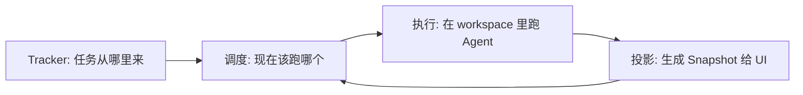
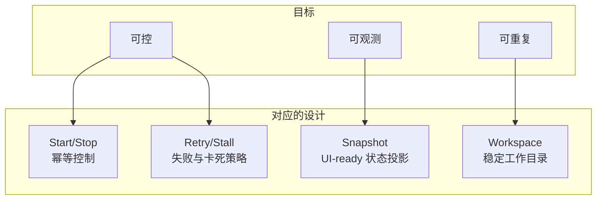

# 哲学理念（我们到底在“守护”什么）

Synclax 的核心不是“让 Agent 更聪明”，而是让 **自动化变得可控**：

- **可启停**：你能明确地开始/暂停/停止，而不是一条脚本跑飞
- **可观测**：UI 能持续展示“现在在做什么 / 为什么卡住 / 要不要重试”
- **可重复**：每个任务都有稳定 workspace，能继续跑、能复盘、能回滚
- **低耦合**：UI 与后台只通过“稳定契约”交互（OpenAPI-first），不靠隐式约定

把它当作一句话：**让 Agent 像服务一样运行（可控、可观测、可维护）。**

## 1) 从“脚本思维”切换到“控制循环”

传统脚本通常是：

- 一次性运行
- 运行中缺少统一状态投影
- 出错只能靠人肉重跑

Synclax 更像一个“控制循环（control loop）”：

这意味着你关心的不是“一个 prompt 能不能一次成”，而是：

- 失败了会怎样（重试/退避/终止）
- 卡住了会怎样（stall 检测/取消）
- UI 能不能讲清楚“现在发生了什么”

## 2) 面向用户的“稳定承诺”

Synclax 对使用者（产品/运营/联调）最重要的承诺是：

1. **状态可被 UI 消费**：不需要读日志，也能知道系统是否在工作
2. **行为可被配置**：任务来源、并发、workspace、hook、prompt 都由工作流文件定义
3. **运行可被控制**：Start/Stop 是系统能力，而不是运维习惯

## 3) 这些理念如何落到具体设计

如果你只记住一个判断标准：**任何“自动化”都必须能被 UI 解释清楚。**

