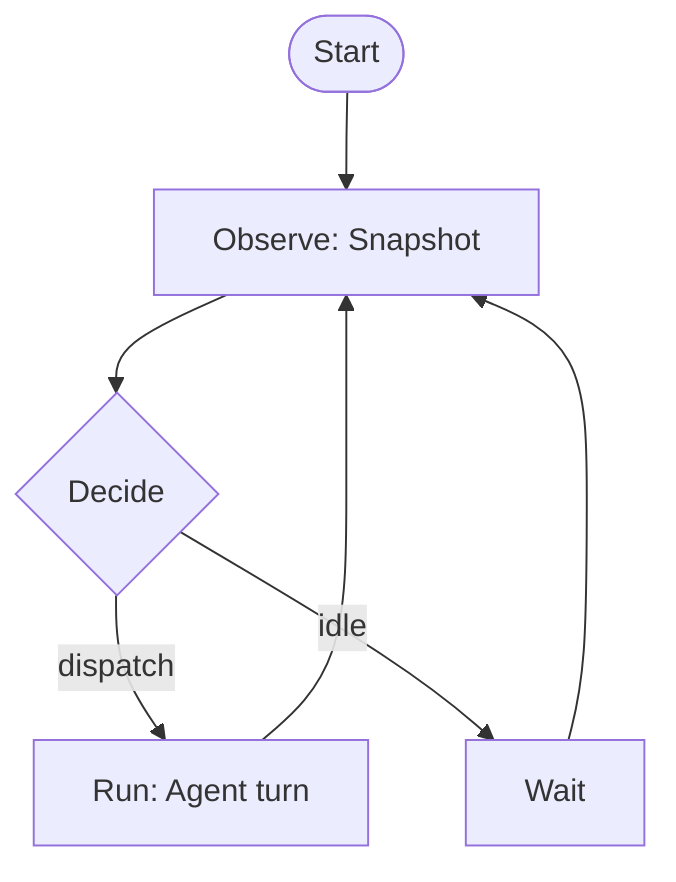
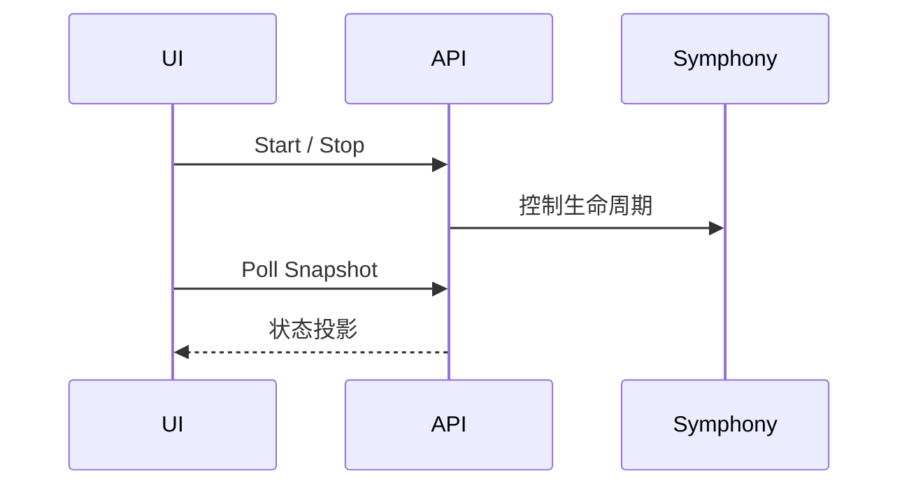

# Mermaid Diagrams（渲染回归页）

这一页的唯一目的：让文档站有一个稳定的 Mermaid 渲染样例，方便验证 Mermaid 渲染是否工作。

Synclax 文档已集成 `vitepress-plugin-mermaid`（并引入 `mermaid`），因此本页也可以作为升级/改配置时的回归检查点。

构建验证：

```bash
pnpm -C docs docs:build
```

## Flowchart



## Sequence


